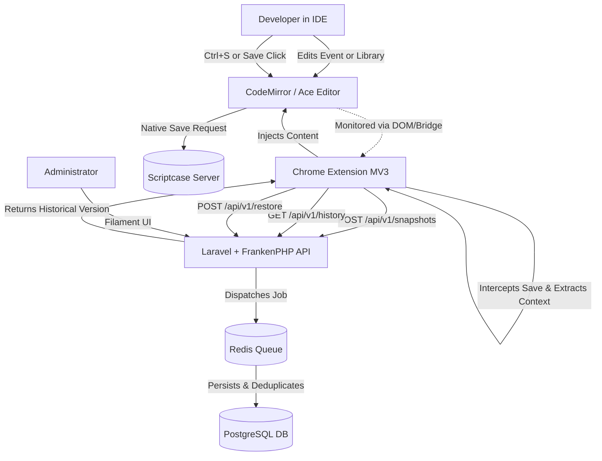

# Agent Guide: Scriptcase Versioning Hub (SVH)

This document describes in detail the inner workings, architecture, data flows, and code structure of the **Scriptcase Versioning Hub (SVH)**, an external versioning ecosystem designed to capture, organize, and restore code snapshots from the Scriptcase IDE.

---

## 1. System Overview

SVH solves the version control limitations of the Scriptcase IDE. Its main characteristic is operating **non-intrusively** relative to the Scriptcase server:
- **Zero Watcher**: No background processes or CLI watchers running on the Scriptcase server.
- **Zero Triggers**: No triggers or audit tables needed in the client's Scriptcase database.
- **Source Capture**: Code interception and author identification (logged-in user) occur entirely inside the developer's browser via the Chrome Extension.

The ecosystem is divided into two main components within the monorepo:
1. **`svh-extension/`**: A Chrome Extension (Manifest V3) written in TypeScript. It injects UI elements into the IDE, intercepts save actions, monitors conflicts from concurrent edits, displays version history, and performs restorations.
2. **`svh-api/`**: A centralized API developed in Laravel 12 (PHP 8.4) running on top of the high-performance FrankenPHP app server (via Laravel Octane). It persists and deduplicates snapshots in PostgreSQL 16 and manages developer presence/concurrency checks using Redis 7.

---

## 2. Architecture & Data Flow

The operational flow of SVH follows this structure:



### 2.1 Capture Flow
1. The developer edits an event or library within the Scriptcase IDE.
2. The extension monitors the DOM and detects the active editor frame.
3. Upon a save action (`Ctrl+S`, clicking the "Save" button, or form submission), the extension extracts the code from the editor and resolves the context (project, application, scope, and logged-in user).
4. Scriptcase's native save process proceeds as usual without blockage.
5. In parallel, the extension generates a SHA-256 hash of the code. If it is not a local duplicate, it sends the payload to `POST /api/v1/snapshots`.
6. The API validates the API key and queues the snapshot for deduplication and database persistence.

### 2.2 Restore Flow
1. The developer opens the extension sidebar, browses the timeline, and selects a snapshot.
2. A side-by-side diff is displayed comparing the current editor buffer (left) against the historical snapshot (right).
3. The developer clicks **Restore**. The extension requests the full content from the API (`POST /api/v1/restore`) and injects it into the active editor instance (CodeMirror/Ace).
4. The extension displays an alert instructing the developer to review the restored code and click the native Scriptcase "Save" button to commit the changes to the Scriptcase server.

---

## 3. Component 1: Chrome Extension (`svh-extension/`)

The extension is the sole capture point of the system and acts as the developer's interface.

### 3.1 Main Internal Scripts
- **`src/content/injector.ts`**: The content script injected into all tabs/frames matching the Scriptcase URL pattern. It initializes controllers, mounts the sidebar UI (Preact + Tailwind CSS), injects the page-world bridge, and listens for concurrent editing conflict events.
- **`src/content/dom-resolver.ts`**: Dynamically resolves the active context by inspecting the DOM and page variables:
  - `cod_prj` (Project Code): Read from `#id_toolbar_codgrp` or global variables.
  - `cod_apl` (Application Code): Extracted from active tab elements (`.nmAbaAppOn`).
  - `scope` (Scope): The name of the event or the path of the library file being edited.
  - `user_sc_login`: The logged-in developer's username, resolved from top bar elements (e.g., `.user`).
- **`src/content/editor-bridge.ts`**: Locates and hooks into the IDE's code editor. It inspects nested frames (such as `frm_sc_code` or `id_ifr_right_`) to expose read (`getValue`) and write (`setValue`) methods. It falls back to the legacy text area `#codigo_php` if no rich editor is found.
- **`src/content/save-interceptor.ts`**: Intercepts save events via a three-layered strategy:
  1. *Form Submissions*: Listens for form submits targeting `event.php` and `methods.php`.
  2. *Keyboard/UI Events*: Intercepts the `Ctrl+S` keystroke and clicks on known save buttons (e.g., `#sc_btn_save`).
  3. *Fetch/XHR Patching*: Injects a script (`inject/fetch-patch.js`) into the page context to hook into native `fetch` and `XMLHttpRequest` calls destined for saving routines.
- **`src/background.ts`**: The background Service Worker. It:
  - Tracks active tab contexts (`SET_CONTEXT`).
  - Handles incoming snapshots and relays requests to the API.
  - Routes cross-frame messages (using `chrome.runtime` and `webNavigation` APIs) between nested frames.
  - Manages the offline `outbox` queue: if the API is unreachable, snapshots are stored in `chrome.storage.local` and re-sent once connection is restored.
  - Executes periodic presence alarms.
- **`src/content/sidebar/sidebar.tsx`**: The Preact UI containing the timeline list, filters, and side-by-side diff comparisons rendered using `diff2html`.

### 3.2 Cross-Frame Communication Strategy
Due to Scriptcase's heavy use of nested iframes, direct access to the CodeMirror instance from the top-level sidebar is blocked or unreliable. SVH resolves this by relaying messages through the Service Worker:
1. The sidebar requests the current buffer by emitting an `SVH_GET_EDITOR_VALUE` event.
2. The local frame's `injector.ts` receives this and posts a message to the page context (`editor-bridge-main.js`).
3. The page-context bridge reads the `.CodeMirror` editor and posts back the result.
4. The frame's injector catches it and sends it to the background: `chrome.runtime.sendMessage({ type: 'SVH_RELAY_TO_TOP' })`.
5. The background broadcasts the value to the top-level frame hosting the sidebar, which updates the diff view.

---

## 4. Component 2: API Backend (`svh-api/`)

The backend API handles authentication, data persistence, diff calculation, presence tracking, and administration.

### 4.1 Endpoints and Routes (`routes/api.php`)
All developer endpoints are protected by the `ApiKeyGuard` middleware, which expects a valid key in the `X-API-Key` header.

| Route | Method | Controller | Description |
| :--- | :--- | :--- | :--- |
| `/api/v1/snapshots` | `POST` | `SnapshotController` | Receives and validates a snapshot, then queues it for persistence. |
| `/api/v1/snapshots/{id}` | `GET` | `SnapshotController` | Retrieves the full payload and code content of a specific snapshot. |
| `/api/v1/history` | `GET` | `HistoryController` | Lists the history timeline for a given scope, paginated via cursor. |
| `/api/v1/diff/{a}/{b}` | `GET` | `DiffController` | Returns the pre-computed unified diff between two snapshots. |
| `/api/v1/diff/raw` | `POST` | `DiffController` | Computes a live diff between the current editor buffer and a saved snapshot. |
| `/api/v1/restore` | `POST` | `RestoreController` | Logs the restore request in the audit trail and returns the code content. |
| `/api/v1/presence` | `POST` | `PresenceController` | Registers developer heartbeat presence details. |
| `/api/v1/presence/conflicts`| `GET` | `PresenceController` | Lists active users currently editing the same application. |
| `/api/health` | `GET` | — | Public endpoint to verify database and queue health. |

### 4.2 Key Services and Jobs
- **`SnapshotService`**: Generates a SHA-256 hash of the received code and compares it with the latest snapshot of the same scope. If the hashes match, the database write is skipped (deduplication).
- **`PresenceService`**: Tracks developer activity and identifies editing conflicts using **Redis**:
  - Detailed metadata is saved in a key expiring in 5 minutes: `presence:details:{prj}:{apl}:{user}`.
  - The user is appended to an application ZSET `presence:active_users:{prj}:{apl}` with the score set to the current timestamp.
  - Active users are fetched by querying members from the ZSET whose timestamps are within the 5-minute active window.
- **`DiffService`**: Computes unified diffs using `sebastian/diff`. Since CodeMirror returns `LF` (\n) line endings while Scriptcase writes to disk using `CRLF` (\r\n), the service normalizes all inputs to `LF` before diffing to prevent false differences. Results are cached in Redis for 1 hour.
- **`PersistSnapshotJob`**: An asynchronous job. When a snapshot is posted, the controller queues this job on the Redis `snapshots` queue and returns a `202 Accepted` response to the extension immediately.

### 4.3 Database Optimization
The `history_snapshots` table in PostgreSQL is optimized for high-frequency source code persistence:
- Storage utilizes a binary column (`content_blob` of type `BYTEA`) configured with **LZ4 compression** at the PostgreSQL database level (`ALTER TABLE history_snapshots ALTER COLUMN content_blob SET COMPRESSION lz4`).
- Indexes are targeted for fast timeline retrieval:
  - `idx_snap_app_scope_captured` on `(application_id, scope, captured_at DESC)`.
  - `idx_snap_project_captured` on `(project_id, captured_at DESC)`.

### 4.4 Global Developer API Keys
Authentication keys are tied to developers, not specific projects or workstations:
- **Single Configuration**: A developer configures their unique key `svh_...` once in the extension. This key is used across all projects.
- **Dynamic Resolution**: Relationships between developers and projects are resolved dynamically. Every snapshot payload includes the `cod_prj` parameter. The API resolves the project internally; if the project is not registered in the admin panel, the request is rejected with `404 Project Not Mapped`.

### 4.5 Data Retention and Baseline Policy
To prevent storage ballooning, a daily scheduler runs `php artisan svh:prune`:
- It purges snapshots older than the project's configured retention threshold (default: 30 days).
- **Baseline Rule**: The pruning command **always preserves the 3 oldest snapshots** for any `(application_id, scope)` combination. This guarantees a basic history timeline remains available even for mature applications that haven't been edited recently.

### 4.6 Filament 3 Admin Panel (`/admin`)
An administrative interface is provided for supervisors and managers:
- **Projects**: CRUD mapping for Scriptcase projects (`cod_prj`) and their retention window.
- **API Keys**: Creation, revocation, and usage tracking of global developer keys.
- **Developer Activity**: Real-time overview of active developers, their current projects, applications, and online status (derived from Redis presence data).
- **Snapshots**: Direct list and filtering of code versions with syntax highlighting.
- **Audit Logs**: Access control and restoration logs.

---

## 5. Main Operational Flows

### 5.1 Save Capture Flow

```
[Extension: Save Action Triggered]
                │
                ▼
[Generate SHA-256 Hash] ──(Local Deduplication Check)──> [Post to API (/snapshots)]
                                                                    │
                                                                    ▼
                                                         [API: Authenticate Key]
                                                                    │
                                                                    ▼
                                                         [Resolve Project & App]
                                                                    │
                                                                    ▼
                                                         [Log Audit Entry]
                                                                    │
                                                                    ▼
                                                         [Dispatch Persist Job] ──> Return 202
                                                                    │
                                                 ┌──────────────────┴──────────────────┐
                                                 ▼                                     ▼
                                       (Verify SHA-256 Dedupe)               (Compress LZ4 & Write)
```

### 5.2 Presence and Conflict Monitoring

```
[Extension: Heartbeat Send (Every 30s)]
                 │
                 ▼
[Post to API (/presence)] ──> [API: Set metadata in Redis Details Key (TTL 5m)]
                              [API: Add user to Redis Application ZSET]
                              
[Extension: Tab Navigated to App]
                 │
                 ▼
[Fetch Conflicts (/presence/conflicts)] ──> [API: Prune ZSET members older than 5m]
                                             [API: Fetch remaining active users in ZSET]
                                             [API: Return list of concurrent users]
                                                                │
                                                                ▼
                                                [Extension: Show Conflict Warning Modal]
```

---

## 6. Guidelines for AI Agents (Safety Rules)

To maintain database integrity and prevent unexpected data loss during testing:
- **No Destructive Database Actions**: NEVER use traits like `RefreshDatabase`, `DatabaseMigrations`, or run commands such as `db:wipe`, `migrate:fresh` inside tests unless it has been explicitly confirmed that the environment is completely isolated (e.g. SQLite in-memory testing) and cannot fall back to the development database connection.
- **Isolate Redis and Caches**: When writing tests, restrict data clearing (`flushall`/`flushdb`) to specific prefixes (e.g. `presence:*`) so that other development cache or session data is not deleted.
- **Configuration Check**: Prior to executing database tests, verify that `phpunit.xml` and `.env.testing` configuration variables are not overridden by docker-compose environment variables or `.env` files that target the active Postgres development schema.
- **Maintain OpenAPI Specification**: Always update `svh-api/public/docs/openapi.yaml` when adding, modifying, or removing API routes, request/response models, or controller validation logic under `routes/api.php` or `app/Http/Controllers/Api/v1/`. Keep the schema accurate and in sync with the backend code.

