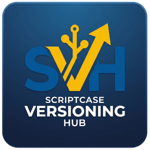

# Scriptcase Versioning Hub (SVH)

<p align="center">
  
</p>

Scriptcase Versioning Hub is an external versioning ecosystem designed to capture, organize, and restore code snapshots from the Scriptcase IDE.

## 🚀 Overview

SVH solves the challenge of versioning within the Scriptcase IDE without requiring changes to the Scriptcase server or database. It works by intercepting save actions directly in the developer's browser and persisting the code to a central hub.

**Key Goals:**
- **Zero Watcher**: No need for CLI watchers or background processes on the Scriptcase server.
- **Zero Triggers**: No database triggers or audit tables needed in the client's Scriptcase database.
- **Automated Capture**: Identifies the logged-in user and project context automatically.

## 🏗️ Architecture

The system consists of two main components:

### 1. Chrome Extension (Manifest V3)
Installed in each developer's browser.
- **Capture**: Intercepts `Ctrl+S`, "Save" button clicks, and internal fetch/XHR requests to detect code changes.
- **Context**: Automatically resolves `cod_prj`, `cod_apl`, scope (events/libs), and the Scriptcase user login.
- **Sidebar**: Provides a real-time timeline of snapshots, side-by-side diffs, and a one-click restore feature.
- **Restore**: Injects historical content back into the IDE editor for review and final saving.

### 2. API Hub (Laravel 12)
Centralized hub for persistence and management.
- **Persistence**: Stores snapshots in PostgreSQL with LZ4 compression.
- **Deduplication**: Uses SHA-256 hashing to avoid storing redundant snapshots.
- **Admin Panel**: Powered by Filament 3, allowing managers to view developer activity, manage API keys, and audit restorations.
- **Performance**: High-concurrency support using FrankenPHP and Laravel Octane.

## 🛠️ Tech Stack

### API (Backend)
- **Framework**: Laravel 12.x (PHP 8.4)
- **App Server**: FrankenPHP + Laravel Octane
- **Admin UI**: Filament 3.x
- **Database**: PostgreSQL 16
- **Cache/Queue**: Redis 7

### Extension (Frontend)
- **Platform**: Chrome Extension Manifest V3
- **Language**: TypeScript
- **Bundler**: esbuild
- **UI**: Preact + Tailwind CSS
- **Utilities**: diff2html

## 📥 Installation & Setup

### Prerequisites

- **Docker** (with Compose v2) — runs the Laravel/Octane stack.
- **Node.js 22+** and **npm** — runs the Vite dev server on the host.
- **PostgreSQL 16** and **Redis 7** — required by the API Hub. The easiest way to get them running locally is via the [opencodeco/stack](https://github.com/opencodeco/stack) project, a ready-to-use Docker-based development stack with both services pre-configured. The instructions below assume PostgreSQL is reachable at `host.docker.internal:5432` (user `postgres`, password `opencodeco`) and Redis at `host.docker.internal:6379`, which matches that stack's defaults.

### API Hub

1.  Navigate to the API directory:
    ```bash
    cd svh-api
    ```

2.  Create the `.env` file from the example and configure the connections:
    ```bash
    cp .env.example .env
    ```
    Edit `.env` and set at least:
    ```env
    DB_CONNECTION=pgsql
    DB_HOST=host.docker.internal
    DB_PORT=5432
    DB_DATABASE=svh_api
    DB_USERNAME=postgres
    DB_PASSWORD=opencodeco

    REDIS_HOST=host.docker.internal
    REDIS_PORT=6379
    ```

3.  Create the application database (once):
    ```bash
    docker exec -i opencodeco-postgres \
      psql -U postgres -c "CREATE DATABASE svh_api;"
    ```
    *(Skip if the database already exists.)*

4.  Generate the `APP_KEY`. Since the container runs as `www-data` and cannot write to your `.env`, generate it from the host:
    ```bash
    KEY="base64:$(openssl rand -base64 32)"
    sed -i "s|^APP_KEY=.*|APP_KEY=${KEY}|" .env
    ```

5.  Prepare the writable directories. The container runs as `www-data` (UID 33) but `storage/`, `bootstrap/cache/` and `public/` are bind-mounted from the host. Open them up for the container:
    ```bash
    # If running locally with appropriate privileges:
    chmod -R 777 storage bootstrap/cache public
    
    # Or using Docker:
    docker run --rm -v "$(pwd)":/app alpine chmod -R 777 /app/storage /app/bootstrap/cache /app/public
    ```

6.  Build and start the stack:
    ```bash
    docker compose up -d --build
    ```
    The container's entrypoint waits for Postgres/Redis, runs `php artisan migrate --force` automatically, and starts FrankenPHP + Octane, queue workers and the scheduler under `supervisord`.

7.  Publish Filament assets (CSS/JS for the admin panel). This is also wired into Composer's `post-autoload-dump`, but the very first run needs it explicitly:
    ```bash
    docker compose exec app php artisan filament:assets
    ```

8.  Create your admin user. The interactive command will prompt for name, email and password:
    ```bash
    docker compose exec app php artisan make:filament-user
    ```
    Or pass the values inline (handy for scripted setups):
    ```bash
    docker compose exec app php artisan make:filament-user \
      --name="Admin" \
      --email="admin@svh.local" \
      --password="password"
    ```
    The password must have at least 8 characters. After creation, sign in at <http://localhost:8080/admin/login>.

    To create additional users later, just run the same command again.

9.  Install front-end dependencies and start the Vite dev server **on the host** (not inside the container):
    ```bash
    npm install
    npm run dev
    ```
    Vite serves assets at `http://localhost:5173` and writes a `public/hot` file so Laravel knows to load them from the dev server.

10. Open the app:
    - **Admin panel**: <http://localhost:8080/admin>
    - **Vite dev server**: <http://localhost:5173>

#### Useful commands

```bash
# Tail Laravel/Octane logs
docker compose logs -f app

# Run an artisan command
docker compose exec app php artisan <command>

# Re-publish Filament assets after upgrading the package
docker compose exec app php artisan filament:upgrade

# Production build of front-end assets
npm run build

# Stop the stack
docker compose down
```

#### Troubleshooting

- **`Permission denied` writing to `storage/logs/laravel.log` or `bootstrap/cache/`** — re-run the `chmod 777` step above. Files created inside the container are owned by `www-data`; if you change ownership on the host, the container loses write access.
- **`EACCES` on `npm install` in the host** — make sure `node_modules/` is owned by your host user (`ls -la node_modules`). If a stray Docker volume left it owned by `root`, remove it with `docker run --rm -v "$(pwd)":/app alpine rm -rf /app/node_modules` and reinstall.
- **404 on `/css/filament/...` or `/js/filament/...`** — Filament assets were not published. Run `docker compose exec app php artisan filament:assets`.
- **`Please provide a valid cache path`** — a framework directory like `storage/framework/views` is missing. We now commit empty `.gitignore` files to keep the directory structure in Git, but if it is still missing, recreate it using `mkdir -p storage/framework/{cache,sessions,views}` on the host.
- **Octane keeps restarting with `copy(/app/public/frankenphp-worker.php): Failed to open stream`** — `public/` is not writable by the container. Fix with `chmod -R 777 public` (or via the `docker run alpine` snippet above).
- **Docker health check shows container as `unhealthy`** — The Dockerfile health check queries `/health` on port 8080, but routes inside `routes/api.php` are prefixed with `/api` by default, making the endpoint `/api/health`. You can safely verify that the application is running by testing `http://localhost:8080/api/health`.

### Chrome Extension

1.  Navigate to the extension directory:
    ```bash
    cd svh-extension
    ```
2.  Install dependencies:
    ```bash
    npm install
    ```
3.  Build the extension:
    ```bash
    npm run build
    ```
4.  Load into Chrome:
    - Open `chrome://extensions/`
    - Enable **Developer mode**.
    - Click **Load unpacked** and select the `svh-extension/dist` folder.
5.  Configure:
    - Click the extension icon and go to **Options**.
    - Set the **API URL** and your **API Key** (generated in the Hub Admin).

## 📂 Project Structure

- `svh-api/`: Laravel backend application.
- `svh-extension/`: Chrome extension source code.

## 📄 License

This project is licensed under the GPL-3.0 license.
